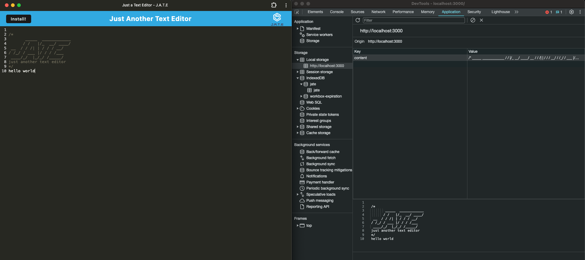

# Text Editor (PWA)

## Description

This is Just Another Text Editor, or JATE, designed as a PWA that allows the user to install the program onto their device for use without connection. You can fill it with notes just as any other notepad, and its designed to save all input to the local storage. 

## Table of Contents

- [User Story](#user-story)
- [Acceptance Criteria](#acceptance-criteria)
- [Usage](#usage)
- [Technologies Used](#technologies-used)
- [License](#license)
- [Credits](#credits)

## User Story

AS A developer
I WANT to create notes or code snippets with or without an internet connection
SO THAT I can reliably retrieve them for later use

## Acceptance Criteria

GIVEN a text editor web application 
WHEN I open my application in my editor 
THEN I should see a client server folder structure 
WHEN I run `npm run start` from the root directory 
THEN I find that my application should start up the backend and serve the client 
WHEN I run the text editor application from my terminal 
THEN I find that my JavaScript files have been bundled using webpack 
WHEN I run my webpack plugins 
THEN I find that I have a generated HTML file, service worker, and a manifest file 
WHEN I use next-gen JavaScript in my application 
THEN I find that the text editor still functions in the browser without errors 
WHEN I open the text editor 
THEN I find that IndexedDB has immediately created a database storage 
WHEN I enter content and subsequently click off of the DOM window 
THEN I find that the content in the text editor has been saved with IndexedDB 
WHEN I reopen the text editor after closing it 
THEN I find that the content in the text editor has been retrieved from our IndexedDB 
WHEN I click on the Install button 
THEN I download my web application as an icon on my desktop 
WHEN I load my web application 
THEN I should have a registered service worker using workbox 
WHEN I register a service worker 
THEN I should have my static assets pre cached upon loading along with subsequent pages and static assets 
WHEN I deploy to Render 
THEN I should have proper build scripts for a webpack application

## Usage

Render Link - https://jate-text-editor-oymd.onrender.com/

GitHub Repo - https://github.com/asierra619/text-editor

## Technologies Used

Render, Express, Concurrently, Nodemon, if-env

## License

MIT

## Credits

Thank you to the following - 
Bobbi Tarkany - Calendly Tutor